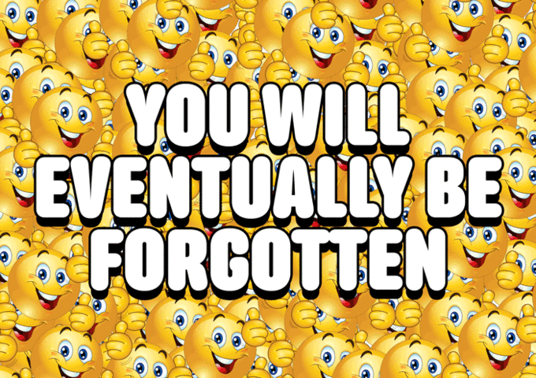
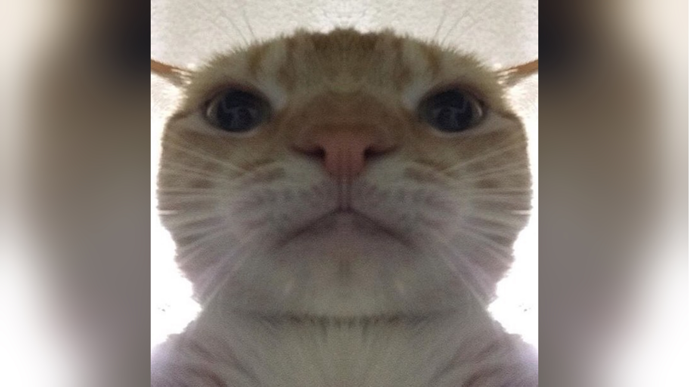
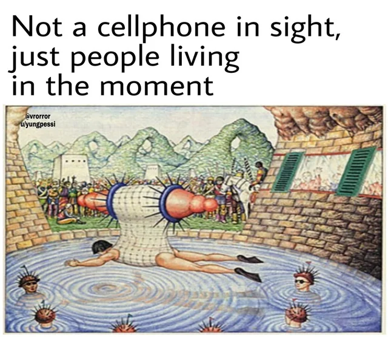
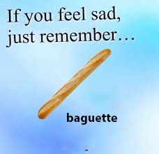

# Memes dank

Cada meme afecta de forma diferente a los enemigos (normie, genz, boomer, nerd, dank)

## dank#1

- like: dank, genz
- dislike: nerd
- confusion: boomer

## dank#2

- like: dank, nerd
- dislike: genz
- confusion: boomer

## dank#3

- like: genz, nerds, dank
- dislike: boomers
- confusion: normie

## dank#4

- like: genz, dank
- dislike: nerds
- confusion: boomers

## dank#5

- like: dank, genz
- dislike: normie
- confusion: boomer

