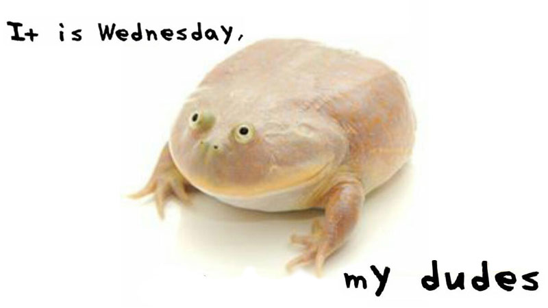

# Memes genz

Cada meme afecta de forma diferente a los enemigos (normie, genz, boomer, nerd, dank)

## genz#1

- like: dank, genz
- dislike: nerd, normie
- confusion: boomer

## genz#2

- like: dank, genz
- dislike: nerd
- confusion: boomer, normie

## genz#3

- like: genz, dank
- dislike: normies, boomer
- confusion: nerd

## genz#4

- like: genz
- dislike: normie
- confusion: normie, nerd, dank 

## genz#5

- like: genz
- dislike: nerd
- confusion: normie, boomer, dank

