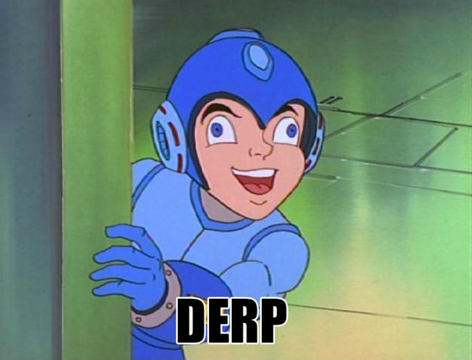
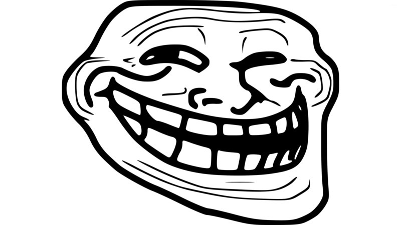

# Memes genz

Cada meme afecta de forma diferente a los enemigos (normie, genz, boomer, nerd, dank)

## boomer#1

- like: boomer
- dislike: genz, nerd
- confusion: dank

## boomer#2

- like: boomer, normie
- dislike: genz, dank
- confusion: nerd

## boomer#3

- like: 
- dislike: 
- confusion:

## boomer#4

- like: 
- dislike: 
- confusion: 

